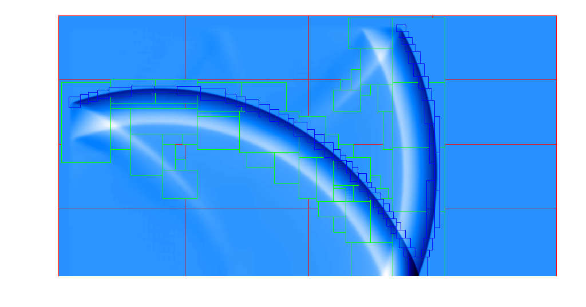
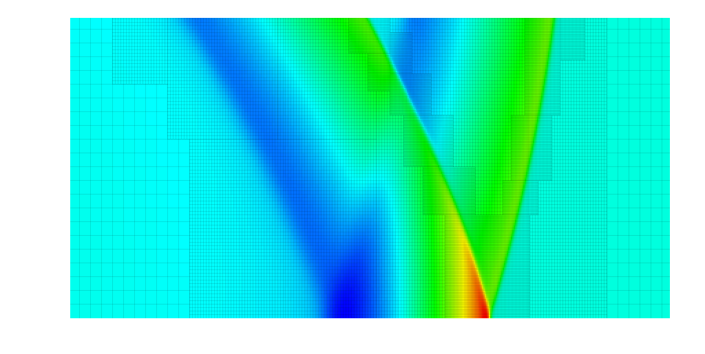

# Enlightning

Simulation software for numerically solving the Navier-Stokes equations using a Runge-Kutta method for the time derivative and a hybrid WENO and DRP finite difference scheme for the space derivative. This software was specifically developed to simulate the numerical acoustical propagation of thunder using the SAMRAI adaptive mesh refinement (AMR) library developed by Lawrence Livermore National Laboratory. Although it had a specific purpose for my research, it can also be used for simulating general nonlinear acoustics problems using very efficient AMR techniques and runs on top of MPI, making it very scalable to massively parallel machines.

## Notes

Refer to [README.txt](README.txt) and [INSTALL.txt](INSTALL.txt) for notes and instructions on installation. Also refer to the [paper](paper/jr_dissertation.pdf) on the simulation, the [Matlab prototype](matlab/hybrid.m) of the model and the [OpenCL prototype](opencl/main.c) of the model in the project directory.

Enlightning relies upon the [zlib](http://www.zlib.net/), [HDF5](http://www.hdfgroup.org/HDF5/), MPI ([Open MPI](http://www.open-mpi.org) or [MPICH](http://www.mpich.org)), and [SAMRAI](https://computation-rnd.llnl.gov/SAMRAI/)(v3.10.0) software libraries.

Use [VisIt](https://wci.llnl.gov/simulation/computer-codes/visit/) for plotting the HDF5 output.

## Example Simulation of a Mach Reflection
Output from example problem in [input.txt](input.txt):

